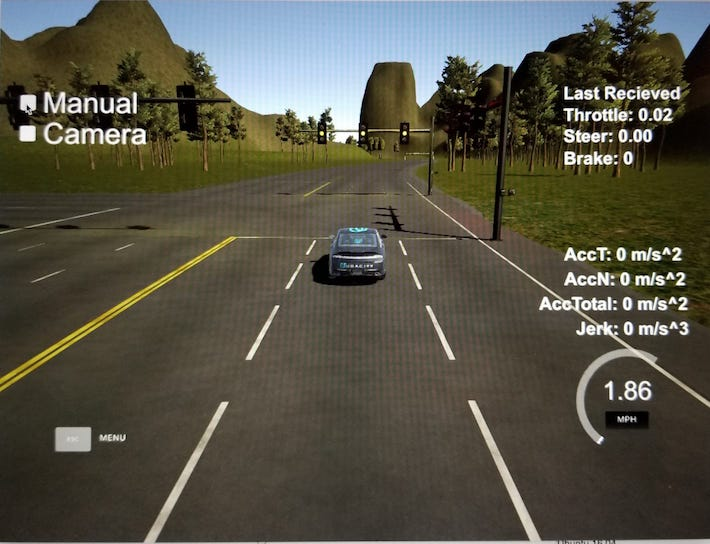

#Introduction 

This is the project repo for the final project of the Udacity Self-Driving Car Nanodegree: Programming a Real Self-Driving Car. For more information about the project, see the project introduction [here](https://classroom.udacity.com/nanodegrees/nd013/parts/6047fe34-d93c-4f50-8336-b70ef10cb4b2/modules/e1a23b06-329a-4684-a717-ad476f0d8dff/lessons/462c933d-9f24-42d3-8bdc-a08a5fc866e4/concepts/5ab4b122-83e6-436d-850f-9f4d26627fd9).

## Team: MissionPeak


| Name          | Udacity Email | Location  | Profile  |
|:-------------| --------------  |:---------------|:---------------------|
| Ahsan Habib <br> (Team Lead) | bibah.nasha@gmail.com |  Santa Clara, CA |  <br> [https://www.linkedin.com/in/habibahsan](https://www.linkedin.com/in/habibahsan/) |
| Krishna  Koravadi |krishna.koravadi@gmail.com    | Rochester Hills, MI|   <br> [https://www.linkedin.com/in/koravadi](https://www.linkedin.com/in/koravadi/)|
| Mahmoud A Selim |  mahmoudahmedselim96@gmail.com |  Cairo, Egypt |               <br>    [https://www.linkedin.com/in/mahmoud-selim](https://www.linkedin.com/in/mahmoud-selim-325b49149/) |
| Sarang Kulkarni | sarang.kulkarni@gmail.com | San Jose, CA       |      <br>  [https://www.linkedin.com/in/sarangkulkarni/](https://www.linkedin.com/in/sarangkulkarni/) |
| Vincent Barrault | vincent.barrault@gmail.com | Frankfurt, Germany |   <br>  [https://www.linkedin.com/in/vincent-barrault](https://www.linkedin.com/in/vincent-barrault-b41a065a/) |

## Simulation Video

Here is the simulation run on highway that uses waypoint path planning, PID controller for controlling speed, steering, and throttle. In this simulation, traffic light waypoint is used to detect the status of light and the car is controlled to stop on red light and go on green. 

[](https://youtu.be/8Jk_cnvKQe4)

Click on the video to see a complete run.
Note: Our code is able to drive the vehicle and complete the highway loop with camera turned OFF in the simulator, when the camera is turned ON with no classification runnning and no suscription to the camera data around 4000 waypoint index the vehcile goes out of control. We think that this may be due to less computation prower and priority of the node execution issue.

Here is the simulation run at test site that uses waypoint path planning, PID controller for controlling speed, steering, and throttle.

[](http://youtu.be/T-opXDjLGu0)

Click on the video to see a complete run.
Note: To make the simulation work for the test site, we need to add these two lines to the site.launch file, so that all the nodes get the vehicle position and velocity from the simulator.

    <!-- Simulator Bridge -->
    <include file="$(find styx)/launch/server.launch" />


## Classifier

### Transfer learning

For classifying the traffic light state (green, red, yellow or unknown), we used already existing models from [Tensorflow detection library](https://github.com/tensorflow/models/blob/master/research/object_detection/g3doc/detection_model_zoo.md). Different models are available. We looked at the following ones:

- faster\_rcnn\_inception\_v2_\coco
- ssd\_inception\_v2\_coco
- ssd\_mobilenet\_v1\_coco

faster\_rncc is very accurate but is very long to process images. ssd\_mobilenet\_v1\_coco is a lot faster but its accuracy is pretty low. Consequently, ssd\_inception\_v2_coco is a good compromise between processing time and good accuracy. This model was chosen for the project. However, it doesn't detect traffic light colors. The model thus must be trained for detecting other shapes/patterns.

### Training

A dataset of ~1200 images has been gathered (mainly from the ROS bag provided by Udacity) and labeled using [labelimg.py](https://github.com/tzutalin/labelImg). 80% were used for training, 20% for testing.

Using tensorflow-gpu, the model has been trained locally on a computer equipped with a NVIDIA GPU (GTX 1050) during around 16000 steps, till the loss is almost always under 2:


### Code

The classifier code is located in tl\_classifier.py and returns its result to tl\_detector.py.

When the classifier finds the class corresponding to a color,  it looks at the probability (or score) that this prediction is correct. This minimum score is 0.45. If the score is below this, the classifier returns that no traffic light state was found.

After the color is return, the detector does not actualize directly the state of the traffic light. It requires that at least 4 images in a row returns the same prediction/color before actualizing the light state. It might happen that the classifier classifies erroneously 1 or 2 images from time to time and this feature avoids that the light state changes because of wrong classifying.

### Results

After running the classifier on roughly 2400 images collected from `traffic ros bag`, we reviewed the outcome. Here are the summary:

|  Color or Classification | Number of images |
| ----| -----:|
| Green  | 1063|
| Red    |  409 |
| Yellow | 288 |
| Other (not a light) | 493 | 
| Incorrect | 126 |

This gives total accuracy of 94.7%

A few example of correct classification:

<p float="left">
  
  
  

</p>

Traffic light images correctly classified with a very high confidence even some of them were far and not very clear.

<p float="left">
  
  
  

</p>

Some traffic light images are classified with a very low confidence. Possible reasons are the distance of camera from the light, which makes the light not clear in the images or brightness of sun is making it hard to distinguish between traffic signals. 


## Native Installation

* Be sure that your workstation is running Ubuntu 16.04 Xenial Xerus or Ubuntu 14.04 Trusty Tahir. [Ubuntu downloads can be found here](https://www.ubuntu.com/download/desktop).
* If using a Virtual Machine to install Ubuntu, use the following configuration as minimum:
  * 2 CPU
  * 2 GB system memory
  * 25 GB of free hard drive space

  The Udacity provided virtual machine has ROS and Dataspeed DBW already installed, so you can skip the next two steps if you are using this.

* Follow these instructions to install ROS
  * [ROS Kinetic](http://wiki.ros.org/kinetic/Installation/Ubuntu) if you have Ubuntu 16.04.
  * [ROS Indigo](http://wiki.ros.org/indigo/Installation/Ubuntu) if you have Ubuntu 14.04.
* [Dataspeed DBW](https://bitbucket.org/DataspeedInc/dbw_mkz_ros)
  * Use this option to install the SDK on a workstation that already has ROS installed: [One Line SDK Install (binary)](https://bitbucket.org/DataspeedInc/dbw_mkz_ros/src/81e63fcc335d7b64139d7482017d6a97b405e250/ROS_SETUP.md?fileviewer=file-view-default)
* Download the [Udacity Simulator](https://github.com/udacity/CarND-Capstone/releases).

## Docker Installation
[Install Docker](https://docs.docker.com/engine/installation/)

Build the docker container
```bash
docker build . -t capstone
```

Run the docker file
```bash
docker run -p 4567:4567 -v $PWD:/capstone -v /tmp/log:/root/.ros/ --rm -it capstone
```


## Usage

1. Clone the project repository
```bash
git clone https://github.com/udacity/CarND-Capstone.git
```

2. Install python dependencies
```bash
cd CarND-Capstone
pip install -r requirements.txt
```
3. Make and run styx
```bash
cd ros
catkin_make
source devel/setup.sh
roslaunch launch/styx.launch
```
4. Run the simulator

## Real world testing
1. Download [training bag](https://s3-us-west-1.amazonaws.com/udacity-selfdrivingcar/traffic_light_bag_file.zip) that was recorded on the Udacity self-driving car.
2. Unzip the file
```bash
unzip traffic_light_bag_file.zip
```
3. Play the bag file
```bash
rosbag play -l traffic_light_bag_file/traffic_light_training.bag
```
4. Launch your project in site mode
```bash
cd CarND-Capstone/ros
roslaunch launch/site.launch
```
5. Confirm that traffic light detection works on real life images
